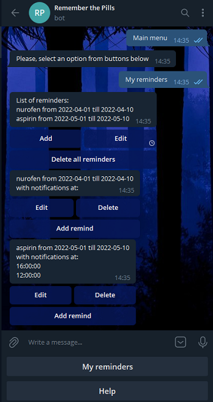
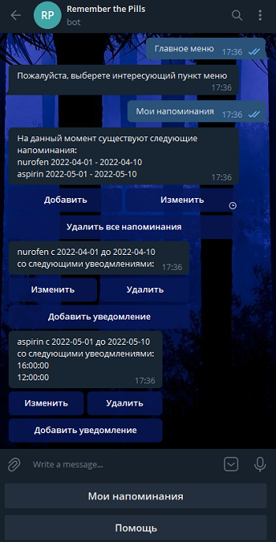

# Remember the pills Telegram bot 

## Description

Telegram bot, that provides service of managing reminders:

- Service provides ability to create, edit and delete reminds, each of those have start and end dates.
- Each remind have notifications with time of notify.
- Service will notify user about item in each notification time between start and end date of remind item.

Bot interface language defines by Telegram user locale:

